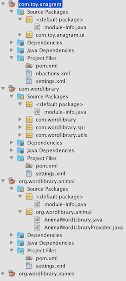

# Modular Maven Anagram Game

A full example showing usage of --module-path in [nbactions.xml](https://github.com/GeertjanWielenga/JigsawJavaModularProjectSamples/blob/master/AnagramGameMaven/com.toy.anagram/nbactions.xml) of 'com.toy.anagram', consisting of three Jigsaw/Maven modules, i.e.,
with module-info.java and POM.xml in each of the three projects, setting dependencies between them. 

The result is a Java Swing
Anagram Game (com.toy.anagram) that loads services of com.wordlibrary, for example, org.wordlibrary.animal.

</img>
