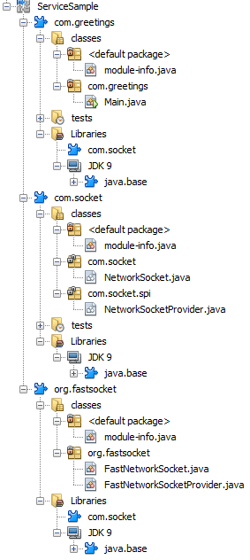
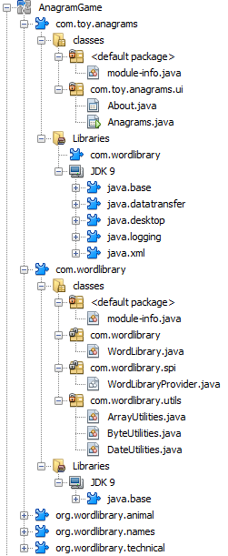

# Jigsaw Java Modular Project Samples

Java SE projects based on Ant to demonstrate Java Modular Projects in JDK 9.

Services sample discussed at <a href="http://openjdk.java.net/projects/jigsaw/quick-start#services">http://openjdk.java.net/projects/jigsaw/quick-start#services</a>:

</img>

NetBeans Anagram Game sample as a multimodular project, as discussed at <a href="https://blogs.oracle.com/geertjan/entry/getting_further_modulerizing_with_jigsaw">https://blogs.oracle.com/geertjan/entry/getting_further_modulerizing_with_jigsaw</a>:

</img>